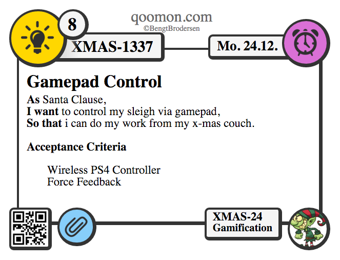

# Issue-Card-Printer

[](https://github.com/qoomon/Jira-Issue-Card-Printer/actions)
[](https://lgtm.com/projects/g/qoomon/Jira-Issue-Card-Printer)


Beautiful Issue Card Printer

I've written a little bookmarklet for converting digital issues in a pretty card layout for printing.

So long
Bengt

## License
[Attribution-NoDerivatives 4.0 International (CC BY-ND 4.0)](https://creativecommons.org/licenses/by-nd/4.0/) 

It is free for personal and professional purpose.

**You are not allowed to change or host this bookmarklet on your own.**

You may fork this project to contribute.

### Installation

Just create a Bookmark with following content as URL
```javascript
javascript:(function(){
 var head = document.getElementsByTagName("head")[0];
 var script = document.createElement("script");
 script.src = "https://qoomon.github.io/Jira-Issue-Card-Printer/bookmarklet.js";
 head.appendChild(script); 
 head.removeChild(script);
})();
```


### Card Layout


### Features
* Multible/Single Issue per Page
* Scale Card Layout
* Cards Informations
 * Issue Type
 * Issue Id
 * Title
 * Description
 * Assignee
 * Due Date
 * Estimate
 * QR Code with Issue Link
 * Tags/Lables/Epics

### Usage
Just select Issue(s) then run the Bookmarklet.
* **Make sure to enable "Print Background Images and Colors"**

Marker to separate description into print and no print area ("~~~~~")

#### Select multiple issues
##### Jira
###### Jira Agile
holding STRG / CMD or SHIFT and click on issues
###### Jira Classic
just search for issues
##### Trello
###### read-only access Boards
select the columns by click on the title so they get highlighted
###### write access Boards
select a column by open the add new card input for specific column


### Support
#### Browser
* **Chrome Browsers 46+**
* **Firefox 67+**
* **Safari 9+**
* **Internet Explore 11+**

#### Issue tracker
* **Jira**
  * e.g. https://connect.atlassian.net/browse/NERDS-33286
* **Bitbucket Issue Tracker**
  * eg https://bitbucket.org/tutorials/tutorials.bitbucket.org/issues
* **Trello**
  * e.g. https://trello.com/b/8zlPSh70/spike
* **PivotTracker**
  * e.g. https://www.pivotaltracker.com/n/projects/510733
* **YouTrack**
  * e.g. http://qoomon.myjetbrains.com/youtrack/dashboard
* **TeamForge**
  * unknown 
* **Mingle**
  * unknown 


### Info
I make use of **Google Analytics** to get some usage feedback.
I will only track the **pageview** and the **amount of rendered cards**
**I do and will not track anything else**

# Developer Notes
* https://sourcemaps.info/
